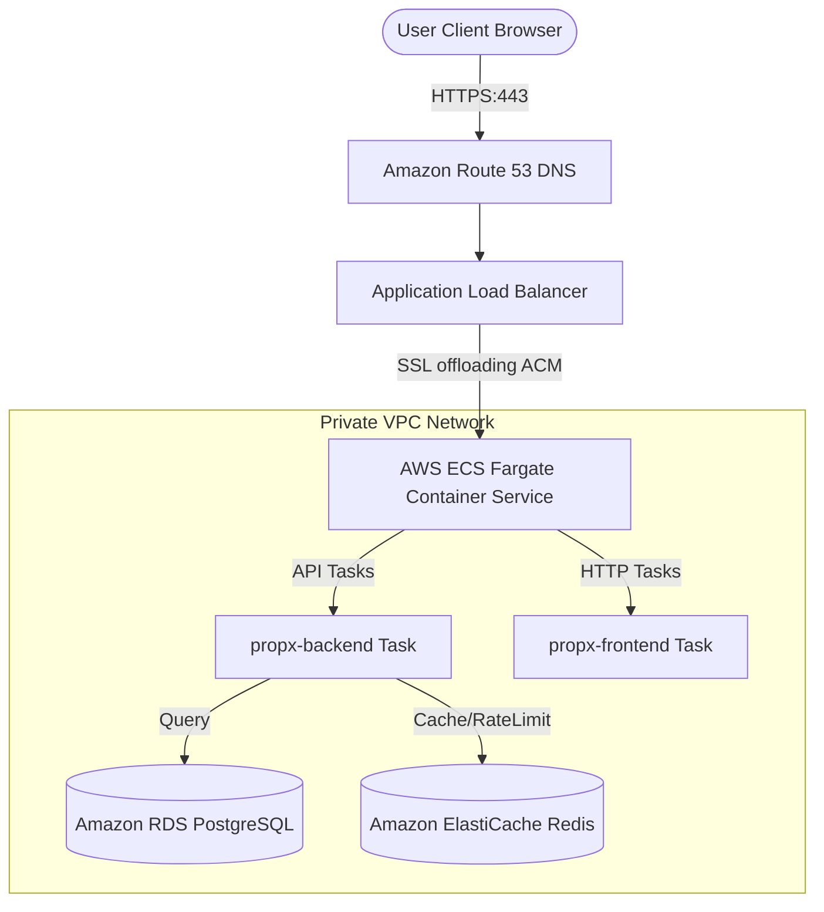

# PropX Production Deployment Guide

This document details the configuration parameters, system requirements, AWS cloud design patterns, and release procedures to host the PropX platform in production.

---

## 1. Environment Variables Configuration

Create a secure `.env` configuration file on the production host or register these variables in your target container orchestration platform (e.g. AWS ECS Task Definition):

### System Configurations
- `NODE_ENV`: Must be set to `production` to activate compiled execution and JSON logging formatting.
- `PORT`: The internal server port. Default is `5000`.
- `JWT_SECRET`: A high-entropy cryptographically secure secret string used for signing session tokens.
- `DATABASE_URL`: Connection string for production PostgreSQL database. Format:
  `postgresql://[db_user]:[db_password]@[db_host]:5432/[db_name]?sslmode=require`

### Rate Limiting (express-rate-limit)
- `RATE_LIMIT_WINDOW_MS`: Time duration window in milliseconds (default: `900000` = 15 minutes).
- `RATE_LIMIT_MAX_REQUESTS`: Maximum requests allowed per IP client per window (default: `100`).

### Logging & Auditing
- `LOG_LEVEL`: Level of winston output (`error`, `warn`, `info`, `debug`). Production default: `info`.

### WhatsApp Business API Configuration
- `WHATSAPP_VERIFY_TOKEN`: Token key configured on Meta's developer dashboard to verify incoming subscription challenges.
- `WHATSAPP_TOKEN`: Meta Graph API token key authorized to send WhatsApp templates.
- `WHATSAPP_PHONE_NUMBER_ID`: Unique phone number ID provided by Meta Business manager.

---

## 2. AWS Production Infrastructure Architecture

A scalable, reliable deployment topology on Amazon Web Services (AWS) uses containerized microservices:



### AWS Infrastructure Provisioning Steps

#### Step 1: Secure Networking (VPC Setup)
1. Set up a **Virtual Private Cloud (VPC)** with:
   - 2 Public Subnets (configured with an Internet Gateway for Load Balancer traffic).
   - 2 Private Subnets (hosting backend container tasks, RDS Postgres instance, and Redis cluster).
   - NAT Gateways in the public subnets to allow private backend containers to fetch external APIs (such as Meta Graph API).

#### Step 2: Database Provisioning (RDS PostgreSQL)
1. Launch an **Amazon RDS for PostgreSQL** database instance inside the private subnet group.
2. Select Multi-AZ deployment for high availability.
3. Configure the Security Group to allow inbound access on TCP port `5432` only from the ECS Backend Security Group.

#### Step 3: Caching Infrastructure (Amazon ElastiCache)
1. Provision a serverless or clustered **Amazon ElastiCache for Redis** instance inside the private subnet group.
2. Configure Security Groups to accept inbound TCP port `6379` traffic exclusively from the backend tasks.

#### Step 4: Container Registry (Amazon ECR)
1. Create two **Amazon ECR (Elastic Container Registry)** repositories: `propx-backend` and `propx-frontend`.
2. Authenticate your CI/CD runner and push the built Docker production images:
   ```bash
   aws ecr get-login-password --region [region] | docker login --username AWS --password-stdin [aws_account_id].dkr.ecr.[region].amazonaws.com
   ```

#### Step 5: Container Orchestration (AWS ECS Fargate)
1. Setup an **AWS ECS Cluster** using AWS Fargate (serverless CPU/Memory task allocations).
2. Create ECS Task Definitions for:
   - **`propx-backend`**: Exposes port `5000`. Mount the database URL, keys, secrets, and task execution roles. Include the healthcheck endpoint: `GET /api/v1/health`.
   - **`propx-frontend`**: Exposes port `80`. Copies compiled frontend files inside the Nginx container proxying backend calls.
3. Launch Fargate Services for both tasks, setting replica tasks across multiple Availability Zones.

#### Step 6: SSL Offloading and Traffic Routing (ALB & Route 53)
1. Request a public SSL certificate using **AWS Certificate Manager (ACM)** for your custom domain name (e.g. `crm.company.com`).
2. Provision an **Application Load Balancer (ALB)** listening on HTTP port `80` (redirecting to `443`) and HTTPS port `443`.
3. Link the ACM SSL certificate to the ALB's HTTPS listener.
4. Establish Target Groups:
   - `tg-frontend`: routes to Fargate frontend containers on port `80`.
   - `tg-backend`: routes traffic starting with path `/api/*` to Fargate backend containers on port `5000`.
5. Point your custom domain record in **Amazon Route 53** as an ALIAS to the Application Load Balancer.

---

## 3. Pre-Flight Production Launch Checklist

Before opening the platform to users, confirm that you have completed these security, performance, and monitoring tasks:

### 🛡️ Security Audit
- [ ] **Secrets Rotation**: Ensure no development secrets (`JWT_SECRET`, default PostgreSQL passwords) are present in environment variables.
- [ ] **HTTPS Routing**: Verify that HTTP port 80 redirects immediately to HTTPS 443 on the load balancer.
- [ ] **CORS Settings**: Restrict CORS headers in `app.ts` to allow requests only from your verified custom domain names.
- [ ] **Security Headers**: Verify Helmet headers are active by querying the site and checking header responses:
  - `X-Frame-Options: DENY`
  - `X-Content-Type-Options: nosniff`
  - `Referrer-Policy: strict-origin-when-cross-origin`

### 📈 Performance & Scaling
- [ ] **Asset Minification**: Verify Vite production builds use minified styles and chunks (built using `npm run build`).
- [ ] **Gzip / Brotli**: Verify Nginx gzip compression is active to compress web traffic payloads.
- [ ] **Database Indexing**: Verify Postgres indexing has been applied to query fields (such as lead phone lookups and organization slugs).
- [ ] **Connection Pooling**: Use connection pool parameters (e.g. PgBouncer or connection limits) in `DATABASE_URL` to prevent thread exhaustion under high loads.

### 📊 Monitoring & Logging
- [ ] **Health Endpoint Monitoring**: Hook up Route 53 Health Checks or CloudWatch alerts to ping `/api/v1/health` every 30 seconds.
- [ ] **Log Storage**: Configure Docker container console logs to aggregate into **AWS CloudWatch logs** or an ELK stack.
- [ ] **Automatic Backups**: Configure RDS database backups with a minimum retention period of 7 days, enabling automated snapshots.

---

## 4. Observability & Prometheus Telemetry

PropX exposes standard telemetry metrics at the `/api/v1/metrics` route formatted for Prometheus scraping:
* **Endpoint**: `GET http://<backend_host>/api/v1/metrics`
* **Response**: `text/plain; version=0.0.4`

### Prometheus Scraping Configuration
Add the following job configuration to your production `prometheus.yml`:
```yaml
scrape_configs:
  - job_name: 'propx-backend'
    scrape_interval: 15s
    metrics_path: '/api/v1/metrics'
    static_configs:
      - targets: ['backend:5000']
```

---

## 5. CI/CD & Deployment Workflows

We use **GitHub Actions** for the build and test CI pipeline. The workflow configuration is located in [.github/workflows/ci.yml](file:///.github/workflows/ci.yml).

### Rolling Deployments & Rollbacks (AWS Fargate)
* **Strategy**: Use **Blue/Green** or **Rolling Update** deployment models.
* **Rolling Updates**: Set the ECS service's minimum healthy percent to `100%` and maximum percent to `200%`. AWS Fargate will spin up new containers, execute container healthchecks against `/api/v1/health` and `/api/v1/liveness`, and then swap traffic on the load balancer without downtime.
* **Rollbacks**: If target metrics (HTTP 5xx rate > 1%) trigger alarms during deployment, roll back by modifying the ECS Task Definition to reference the previous Docker image tag.

---

## 6. Database Backup, Restore, and Disaster Recovery

### Automated Backups (RDS)
* Enable RDS Automated Backups with a 14-day retention.
* Enable Point-in-Time Recovery (PITR) to restore your database to any state within the retention period down to the second.

### Manual Database Backups (pg_dump)
To perform a manual backup of your PostgreSQL database (e.g. before major schema migrations):
```bash
# Backup database schema and data into a compressed archive
pg_dump -h [db_host] -U postgres -F c -b -v -f propx_backup_$(date +%F).dump propx_db
```

### Database Restore (pg_restore)
In the event of database corruption or a disaster recovery scenario:
```bash
# Terminate existing active connections to prevent file locks
psql -h [db_host] -U postgres -d propx_db -c "SELECT pg_terminate_backend(pid) FROM pg_stat_activity WHERE datname = 'propx_db' AND pid <> pg_backend_pid();"

# Restore database from the dump archive
pg_restore -h [db_host] -U postgres -d propx_db -v propx_backup_XXXX.dump
```
